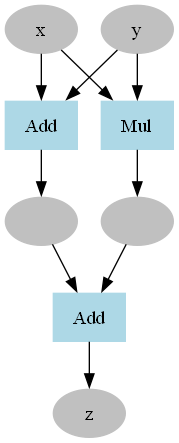

# another-pytorch

实现一个类似pytorch的深度学习框架



## 已经实现的特性

* 动态计算图
* 网络层
* 数据集
* 数据加载器
* 优化器
* 支持CUDA

## 使用示例(demo.py)

```python
from layers import *
from optimizers import * 
from dataloader import *
from dataset import * 

print('[CUDA]MNIST分类模型')

# model
class MNIST_MLP(Layer):
    def __init__(self):
        super().__init__()
        self.linear1=Linear(28*28,1000)
        self.relu1=Relu()
        self.linear2=Linear(1000,10)
    
    def _forward(self,x): 
        y=self.linear1(x)
        y=self.relu1(y)
        return self.linear2(y)

# feature transofmer
def img_transformer(x):
    x=x.flatten()
    x=x/256.0
    return x 

# evaluation
def accuracy(output,t):
    pred_t=output.data.argmax(axis=-1)
    acc=(pred_t==t.data).sum()/t.shape[0]
    return Variable(acc)

# hyper parameter
epoch=20
batch_size=1000

# dataset
train_dataset=MNISTDataset(train=True,transformer=img_transformer)
test_dataset=MNISTDataset(train=False,transformer=img_transformer)

# dataloader
train_dataloader=DataLoader(train_dataset,batch_size)
test_dataloader=DataLoader(test_dataset,batch_size)

# model
model=MNIST_MLP().to_cuda()

# optimizer
optimizer=MomentumSGB(model.params(),lr=0.1)

# loss function
loss_fn=SoftmaxCrossEntropy1D().to_cuda()

# training
try:
    for e in range(epoch):
        epoch_loss=0
        epoch_acc=0
        iters=0
        for x,t in train_dataloader:
            x=x.to_cuda()
            t=t.to_cuda() 
            output=model(x)

            loss=loss_fn(output,t)
            model.zero_grads()
            loss.backward()
            optimizer.step()
            epoch_loss+=loss.data
            iters+=1
            acc=accuracy(output,t)
            epoch_acc+=acc
        print('avg_loss:',epoch_loss/iters,'avg_acc:',epoch_acc/iters)
except Exception as e:
    print('没有NVIDIA显卡,',e)
```

```
[CUDA]MNIST分类模型
avg_loss: 0.5870233558204565 avg_acc: 0.8359500000000001
avg_loss: 0.24794054798529447 avg_acc: 0.9296333333333331
avg_loss: 0.1893487594307535 avg_acc: 0.9465
avg_loss: 0.15307746508846928 avg_acc: 0.9570333333333335
avg_loss: 0.12775041981427354 avg_acc: 0.9647333333333331
avg_loss: 0.10908713074692564 avg_acc: 0.9699833333333334
avg_loss: 0.09513565251379025 avg_acc: 0.9740833333333331
avg_loss: 0.08433023146992916 avg_acc: 0.976983333333333
avg_loss: 0.07573023617874479 avg_acc: 0.9795166666666664
avg_loss: 0.06861133975187987 avg_acc: 0.981833333333333
avg_loss: 0.06258074249440213 avg_acc: 0.9835999999999997
avg_loss: 0.05734887189983983 avg_acc: 0.984633333333333
avg_loss: 0.05275312853040119 avg_acc: 0.9861499999999993
avg_loss: 0.048678454629432634 avg_acc: 0.9874333333333332
avg_loss: 0.04503827774385733 avg_acc: 0.9885666666666663
avg_loss: 0.041788410418632176 avg_acc: 0.9896999999999998
avg_loss: 0.038867067144207894 avg_acc: 0.9906
avg_loss: 0.0362750277808008 avg_acc: 0.9914999999999999
avg_loss: 0.0339194962084964 avg_acc: 0.9921999999999999
avg_loss: 0.03175617374426474 avg_acc: 0.9928499999999997
```